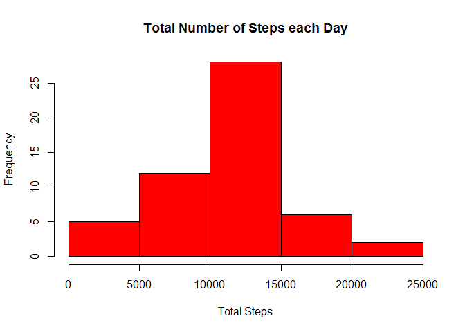
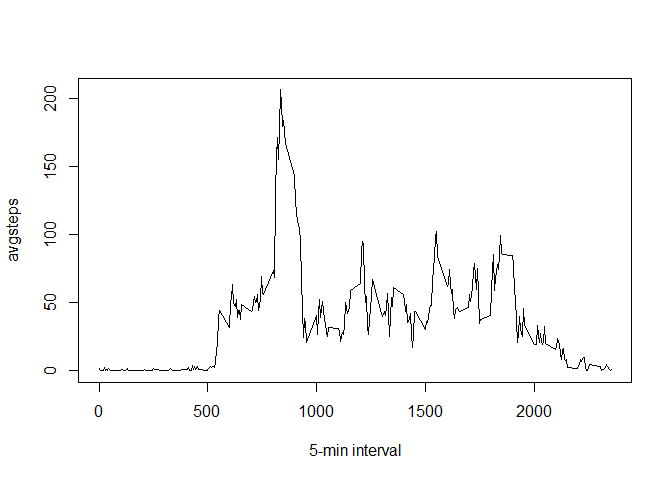
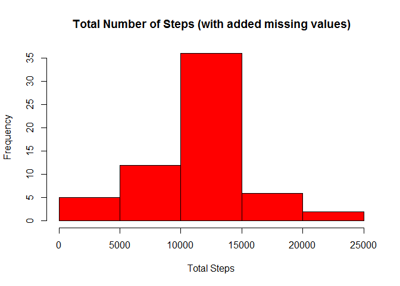
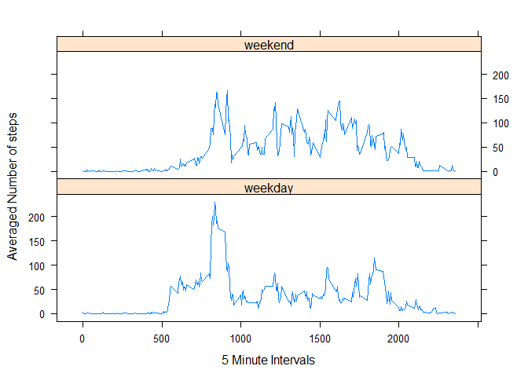

# PA_Assignment1


It is now possible to collect a large amount of data about personal movement using activity monitoring devices such as a Fitbit, Nike Fuelband, or Jawbone Up. These type of devices are part of the "quantified self" movement - a group of enthusiasts who take measurements about themselves regularly to improve their health, to find patterns in their behavior, or because they are tech geeks. But these data remain under-utilized both because the raw data are hard to obtain and there is a lack of statistical methods and software for processing and interpreting the data.

This assignment makes use of data from a personal activity monitoring device. This device collects data at 5 minute intervals through out the day. The data consists of two months of data from an anonymous individual collected during the months of October and November, 2012 and include the number of steps taken in 5 minute intervals each day.
Data

The data for this assignment can be downloaded from the course web site.

The variables included in this dataset are:

    steps: Number of steps taking in a 5-minute interval (missing values are coded as NA)

    date: The date on which the measurement was taken in YYYY-MM-DD format

    interval: Identifier for the 5-minute interval in which measurement was taken

The dataset is stored in a comma-separated-value (CSV) file and there are a total of 17,568 observations in this dataset.

##Loading and preprocessing the data


```r
echo = TRUE
setwd("C:/RStudio/Reproducible Research/Assignment1")
## read full data file
actData <- read.csv("activity.csv", header = T, sep = ',' )
## format steps as numeric so we can work with them
actData$steps<-as.numeric(as.character(actData$steps))
```

##What is mean total number of steps taken per day?

```r
## total the number of steps by date for plot 1
aggdata <-aggregate(actData$steps, by=list(actData$date),FUN=sum, na.rm=FALSE)
## assign proper column names
colnames(aggdata) <- c("date", "dailysteps")
```

 Make a histogram of the total number of steps taken each day

```r
hist(aggdata$dailysteps, col = "Red", main = "Total Number of Steps each Day", xlab = "Total Steps")
```

 

Calculate and report the mean and median of the total number of steps taken per day (report??)
echo = True

```r
meansteps <- mean(aggdata$dailysteps, na.rm=TRUE)
print(c("The mean equals ",meansteps))
```

```
## [1] "The mean equals " "10766.1886792453"
```

```r
mediansteps <- median(aggdata$dailysteps, na.rm=TRUE)
print(c("The median equals ",meansteps))
```

```
## [1] "The median equals " "10766.1886792453"
```

##What is the average daily activity pattern?
Make a time series plot (i.e. type = "l") of the 5-minute interval (x-axis) and the average number of steps taken, averaged across all days (y-axis)

```r
avgsteps <- tapply(actData$steps, actData$interval, mean, na.rm=T)
plot(avgsteps ~ unique(actData$interval), type="l", xlab = "5-min interval")
```

 

Which 5-minute interval, on average across all the days in the dataset, contains the maximum number of steps?

```r
echo = TRUE
avgsteps[which.max(avgsteps)]
```

```
##      835 
## 206.1698
```
##Imputing missing values
Calculate and report the total number of missing values in the dataset (i.e. the total number of rows with NAs)

```r
echo = TRUE
sum(is.na(actData))
```

```
## [1] 2304
```
#Devise a strategy for filling in all of the missing values in the dataset.
i am going to populate the missing values with the mean of an interval. I had calulated the mean of each
interval above in and its held in "avgsteps"

```r
##3. Create a new dataset that is equal to the original dataset but with the missing data filled in.
echo = TRUE
actnewData <- actData

for (i in 1:nrow(actnewData)) {
    if (is.na(actnewData$steps[i])) {
        actnewData$steps[i]<- avgsteps[[as.character(actnewData[i, "interval"])]]
    }
}
head(actnewData)
```

```
##       steps       date interval
## 1 1.7169811 2012-10-01        0
## 2 0.3396226 2012-10-01        5
## 3 0.1320755 2012-10-01       10
## 4 0.1509434 2012-10-01       15
## 5 0.0754717 2012-10-01       20
## 6 2.0943396 2012-10-01       25
```
Make a histogram of the total number of steps taken each day and Calculate and report the mean and median total number of steps taken per day. Do these values differ from the estimates from the first part of the assignment? What is the impact of imputing missing data on the estimates of the total daily number of steps?

```r
totnewdata <-aggregate(actnewData$steps, by=list(actnewData$date),FUN=sum, na.rm=FALSE)
## assign proper column names
colnames(totnewdata) <- c("date", "dailysteps")

## Make a histogram of the total number of steps taken each day
hist(totnewdata$dailysteps, col = "Red", main = "Total Number of Steps (with added missing values)", xlab = "Total Steps")
```

 

Calculate and report the mean and median of the total number of steps taken per day

```r
meannewsteps <- mean(totnewdata$dailysteps)
print(c("The mean equals ",meannewsteps))
```

```
## [1] "The mean equals " "10766.1886792453"
```

```r
mediannewsteps <- median(totnewdata$dailysteps)
print(c("The mean equals ",mediannewsteps))
```

```
## [1] "The mean equals " "10766.1886792453"
```
No these values are very similar to the original data - this makes sense because we used mean values for each interval to replace the names - however there is diffferences in the first & third quantiles. See below.

```r
summary(aggdata) ## the Summary details showing total steps per day including na's
```

```
##          date      dailysteps   
##  2012-10-01: 1   Min.   :   41  
##  2012-10-02: 1   1st Qu.: 8841  
##  2012-10-03: 1   Median :10765  
##  2012-10-04: 1   Mean   :10766  
##  2012-10-05: 1   3rd Qu.:13294  
##  2012-10-06: 1   Max.   :21194  
##  (Other)   :55   NA's   :8
```

```r
summary(totnewdata) ## total steps per day with nas replaced with means of intervals
```

```
##          date      dailysteps   
##  2012-10-01: 1   Min.   :   41  
##  2012-10-02: 1   1st Qu.: 9819  
##  2012-10-03: 1   Median :10766  
##  2012-10-04: 1   Mean   :10766  
##  2012-10-05: 1   3rd Qu.:12811  
##  2012-10-06: 1   Max.   :21194  
##  (Other)   :55
```
##Are there differences in activity patterns between weekdays and weekends?
Create a new factor variable in the dataset with two levels - "weekday" and "weekend" indicating whether a given date is a weekday or weekend day.

```r
actnewData$date <-as.Date(actnewData$date)
actnewData$weekdays <-factor(format(actnewData$date,"%A"))
levels(actnewData$weekdays) <-list(weekday =c("Monday","Tuesday","Wednesday","Thursday","Friday"),weekend =c("Saturday","Sunday"))
head(actnewData)
```

```
##       steps       date interval weekdays
## 1 1.7169811 2012-10-01        0  weekday
## 2 0.3396226 2012-10-01        5  weekday
## 3 0.1320755 2012-10-01       10  weekday
## 4 0.1509434 2012-10-01       15  weekday
## 5 0.0754717 2012-10-01       20  weekday
## 6 2.0943396 2012-10-01       25  weekday
```
Make a panel plot containing a time series plot (i.e. type = "l") of the 5-minute interval (x-axis) and the average number of steps taken, averaged across all weekday days or weekend days (y-axis).

```r
library(lattice)
```

```
## Warning: package 'lattice' was built under R version 3.2.2
```

```r
weekdiff <-aggregate(steps ~interval + weekdays,data=actnewData, mean)

xyplot(weekdiff$steps ~weekdiff$interval |weekdiff$weekdays,
layout =c(1,2),
type ="l",
xlab ="5 Minute Intervals",
ylab ="Averaged Number of steps")
```

 
